# Annotation Pipeline
*From model output to species MaxN metrics...*

## Contents

* <a href="#overview">Overview</a>
* <a href="#understand-the-output">Understand the Output</a>
* <a href="#cleaning-the-output">Cleaning the output</a>
* <a href="#extract-maxn">Extract MaxN</a>

## Overview
After running SharkTrack on your videos, you should have an output similar to [this folder](./static/test_output/). This page provides instructions on converting the output to MaxN metrics.

To do so, you will perform two steps:
1. **Cleaning the Output**: Here you will delete wrong detections and assign species ID to the correct ones.
2. Generate **MaxN** from the cleaned output

Below you can find guidance on each step.

## Understand the Output
Before we compute MaxN, it is important to understand the model output.

> **TL;DR:** When SharkTrack detects a shark, it tracks it across frames, generating a "Shark Track". Then, it saves all results in `output.csv` and for each track stores in a frame where it was detected. Thanks to this, the user only needs to validate/classify the same shark once as we take care of tracking it!

Locate the output directory. It should be `./output`, unless you have provided a custom `--output` argument when running `python app.py`. The folder will look something [like this](./static/test_output/) and it contains :
- `output.csv` lists each detection at each timeframe for each video
- `detections/` for each tracked elasmobranch, saves the `.jpg` frame in which its track achieved highest confidence.
- `overview.csv` Lists all videos processed and tracks found in each.

    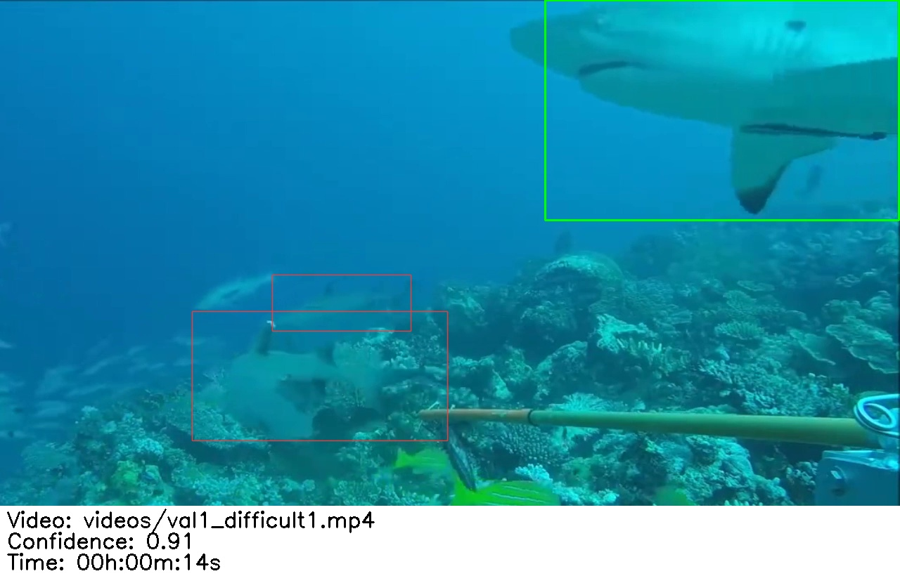

    *The image shows the shark (thicker box) whose track achieved the higest confidence in this frame, over all other frames in which the same shark was detected. It also shows other detections (thinner boxes).*

    *Below the image, you can read the name of the video file, confidence and time of the detection in the thicker box.*

### Output FAQs
- **What is a track?** The same elasmobranch will appear in multiple (consecutive) frames of the video. A track is a bounding box with an id, saying "this is the same shark I found before" 
- **What is a `max-conf-detection`?** A track is made up of different detections for the same elasmobranch at different times. Each detection has a confidence score. The `max-conf-detection` is the detection (frame,time,bounding box) which achieved the highest score, and it's associated frame is saved in the detection folder of each video for each track found there
- **Why does it matter?** This allows the user to process only once annotation per track, instead of thousands of frames. Once the user is done with the cleaning, a script automatically reflects the changes on every detection for the track, computing MaxN
- **But one frame is not enough to determine the species of a shark** That's why we show in the frame the video path and time, so you can go back to the video, and use it to assign a Species.
- **I am seing the same elasmobranch in multiple detections**: The model might think the same shark two or more sharks appearing consequently. In this case, classify all of them. This will not affect the MaxN accuracy, it will only require you to classify more images.
- **But...?** If you have any other question, feel free to [email us](mailto:fppvrn@gmail.com?subject=SharkTrackFAQ)

## Cleaning the Output
Here, we define *detections* as the image showing the highest-confidence detection of a Track (*same elasmobranch in multiple frames*).
Now that you understand the model output, you need to clean it by:
- Rejecting tracks that are not of elasmobranchii
- Assigning Species ID to the remaining detection images.

### Cleaning Guide
SharkTrack saves an image for each track in the `detections/` folder. In this image, it highlights the track with a *thick* bounding box. Additionally, it also tells what else it found in the same image, with *thin* bounding boxes. 

The purpose of the thin boxes is to tell you that those additional sharks have their own detection image in the same `./detection` folder.

If you see a shark with no box around it, you know the model missed this shark. 

*By classifying the image above, you are only classifying the shark in the thick box.*

Sometimes, it is ambiguous whether you should accept or reject the detection. Therefore, below, we provide examples of detection files and what cleaning action should be performed.

| | | |
|:-------------------------:|:-------------------------:|:-------------------------:|
|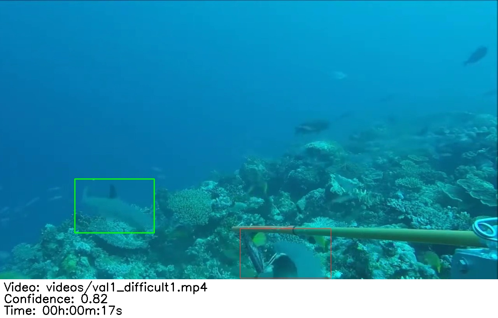  Confirm detection and assign species |  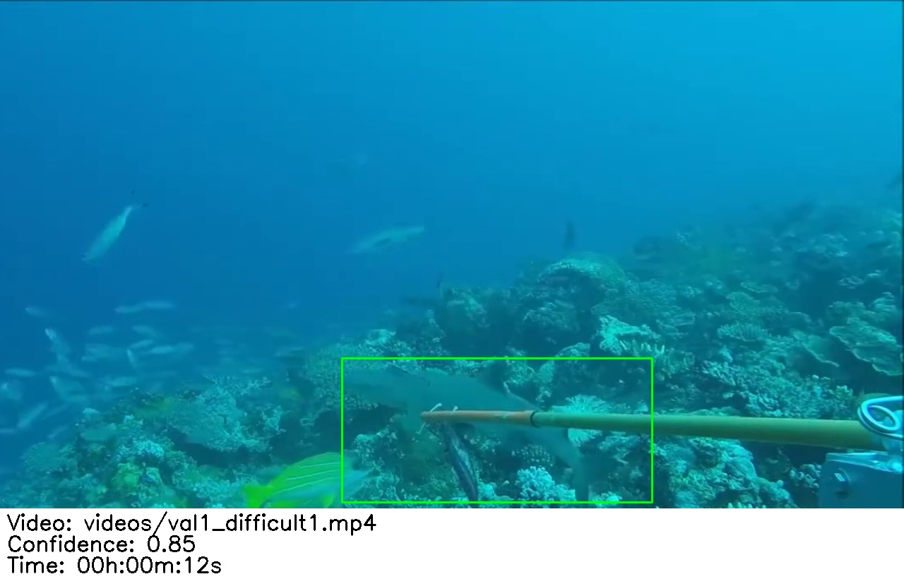 Confirm detection and assign species | Confirm detection and assign species |
|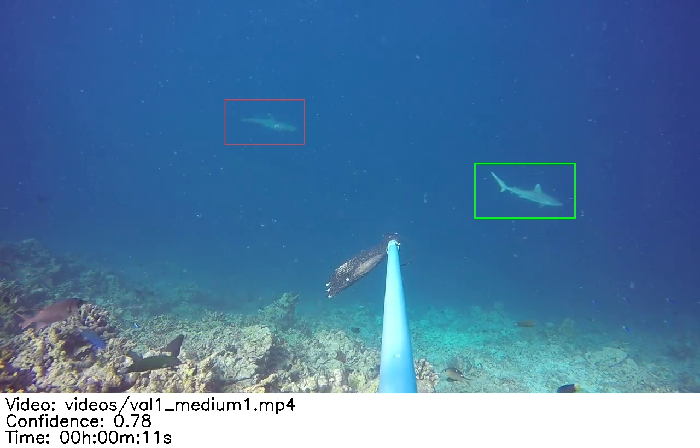 Confirm and assign species |  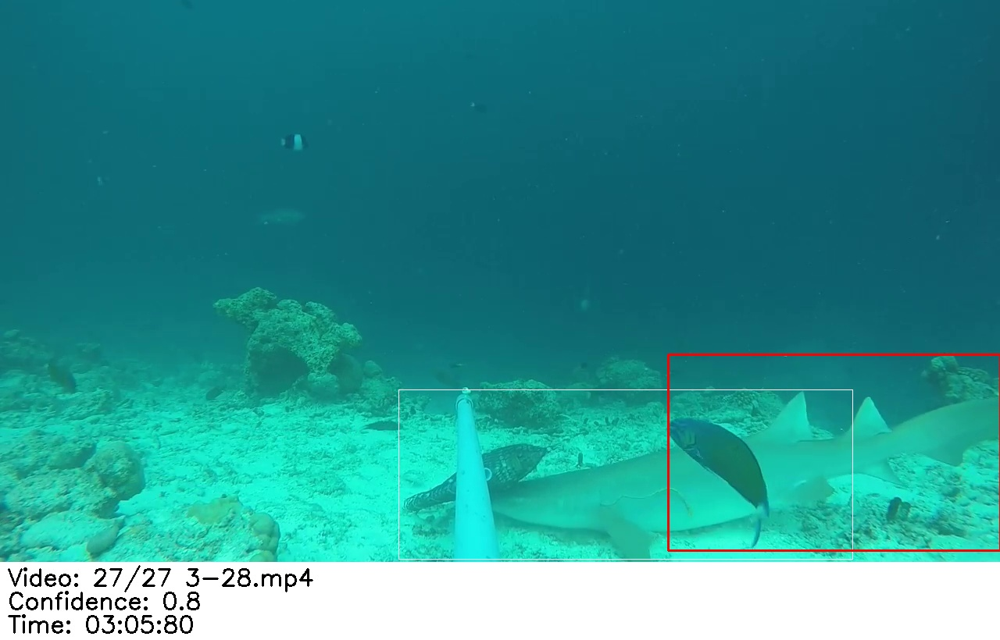 Reject as it already exists (thin box)|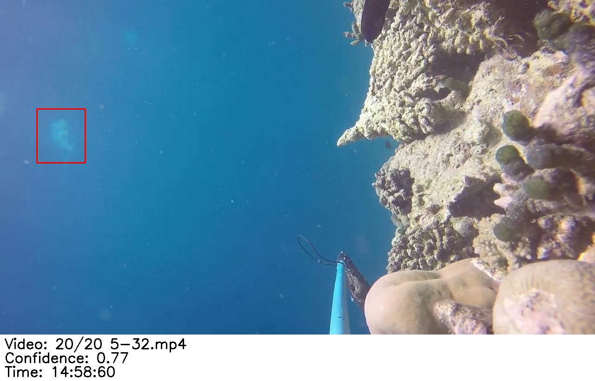 Reject detection as not elasmobranch|
|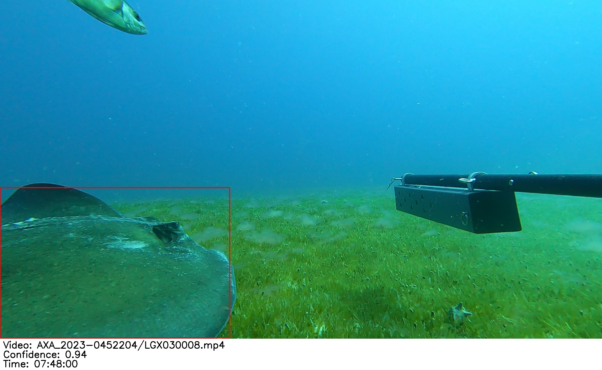 Confirm and assign ray species  |  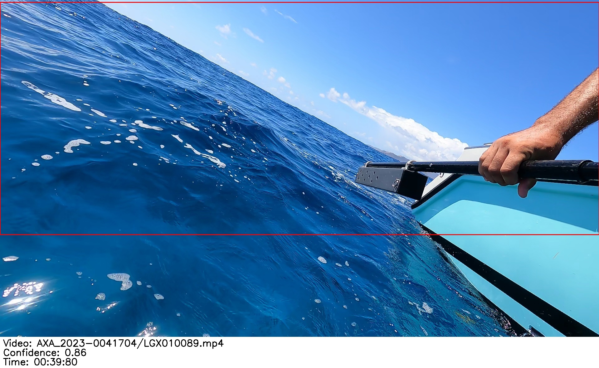 Definitely not elasmobranch!|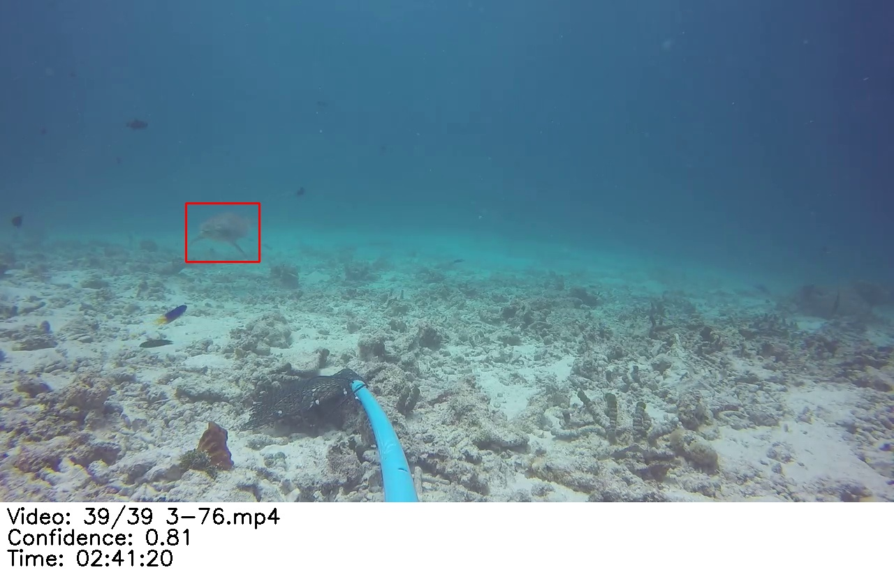 Hmm tricky! Check the suggested video and time to know better!|

### Annotation Pipeline
Once you have seen the output, it is time to clean it. This is the step where we leverage *your* knowledge to ID the Elasmobranch.

Find pro tips [here](#🚀-pro-tips) 

1. For each video, open the respective folder. It will have many detections named `{track_id}.jpg`
2. Scroll through all images and locate the relative detection, which is the *thick* box
3. If the detection is not an elasmobranch, delete the file
4. If the detection is an elasmobranch, rename the file with the species id, **keeping the original number** separated by a "-" (example: `1-scallop_hamhead.jpg`)
    
    **Important:** you can write whichever species id but make sure to keep the original `track_id` number separated with a "-"

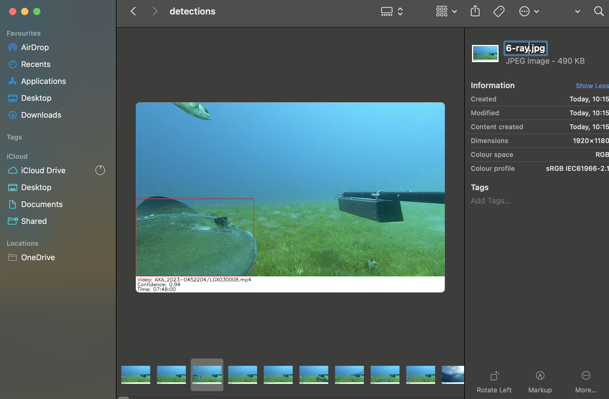
*As shown in this picture, we are renaming the detection with the species id, in this case "ray". We are leaving the original track_id and separating with a "-".

#### 🚀 Pro Tips
- Do a first pass to remove all wrong detections and assign species ID in a second pass
- If unsure about species/validity you might want to look at the raw video, look at the text at the bottom of the image to find the relative video and time.
    
    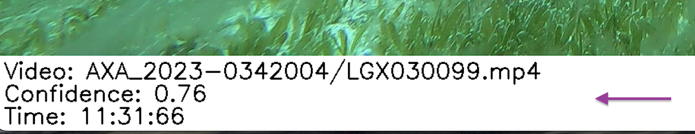

- If on Windows, use F2 to rename the file quickly and Crl+D to remove it
- If on Mac, visualise image in Gallery mode, use Cmd+Del to remove the image and Enter to rename the file

#### Collaborating
If you want multiple users to annotate the detections, you can simply upload the whole output folder on a drive (Google, DropBox, OneDrive etc) and perform the above steps there!

## Extract MaxN
Amazing! You have cleaned all annotations, it's time to generate MaxN from it!

You can compute MaxN locally by following the steps below:

- Open the Prompt/Terminal at the `sharktrack` folder location as you did when running the model in the [User Guide](./sharktrack-user-guide.md) step.
- Activate the virtual environment (guide [here](./sharktrack-user-guide.md#setup-environment))
- Run `python utils/compute_maxn.py --path <output_path>`, replacing `<output_path>` with the path of the folder that contains the `output.csv` file and all the detection folders.
    Example: `python utils/compute_maxn.py --path output`
- You can optionally provide a path to the original videos, to output the MaxN `jpg` Frames
- You will see a `maxn.csv` file in the SharkTrack folder

🚀 Hooray! You have obtained the MaxN! 