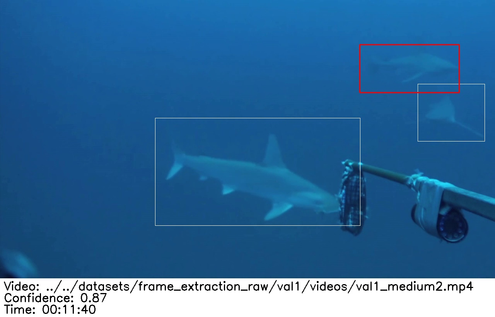

# Annotation Pipeline
*From model output to species MaxN metrics...*

## Contents

* <a href="#overview">Overview</a>
* <a href="#annotation-cleaning-and-species-id">Annotation Cleaning and Species ID</a>
* <a href="#extract-maxn">Extract MaxN</a>
* <a href="#how-people-run-sharktrack">How do people run SharkTrack?</a>
* <a href="#list-of-people-using-it">List of people using it</a>
* <a href="#collaborations">Collaborations</a>


## Overview
After running SharkTrack on your video, you should have an output similar to [this folder](./static/test-output/).

This page provides instruction on generating MaxN metrics from the model output. To do so, firstly the user will clean the annotations and assign Species ID and secondly run a script that automatically computes MaxN metrics.

You can also follow this documentation using the following video tutorials:

- [Uploading and cleaning detections in VIAME](https://drive.google.com/file/d/16Zw69ELvA1_pBhfcbQsjo1nc_7EBYZl2/view?usp=sharing)
- [Computing MaxN after downloading VIAME-cleaned detections](https://drive.google.com/file/d/1DCT3vCAbAH4T8wTiMjgWUc7-lZEpgz9U/view?usp=drive_link)


## Annotation Cleaning and Species ID

We provide a simple step-by-step pipeline to clean the SharkTrack detections using the [VIAME](https://viame.kitware.com/) annotation tool:

### 1. View the Output:
Locate the output directory. It should be `./output`, unless you have provided a custom `--output_root` argument. The folder will look something [like this](./static/test-output/) and it contains :
- `output.csv` lists each detection at each timeframe for each video
- `viame.csv` for each tracked shark, records the detection which achieved the highest confidence (`max-conf-detection`)
- `detections/` for each tracked shark, saves the `.jpg` frame in which the shark track achieved highest confidence.
    
    *The image shows the shark (red box) whose track achieved the higest confidence in this frame, over all others in which the same shark was detected. It also shows other detections (white boxes) and the video, time and confidence of the red detection*

#### Output FAQs
- **What is a track?** The same elasmobranch will appear in multiple (consecutive) frames of the video. A track is a bounding box with an id, saying "this is the same shark I found before" 
- **What is a `max-conf-detection`?** A track is made up of different detections for the same elasmobranch at different times. Each detection has a confidence score. The `max-conf-detection` is the detection (frame,time,bounding box) which achieved the highest score, and it's associated frame is saved in the `./detections/` folder for each track
- **Why does it matter?** This allows the user to process only once annotation per track, instead of thousands of frames. Once the user is done with the cleaning, a script automatically reflects the changes on every detection for the track, computing MaxN
- **But one frame is not enough to determine the species of a shark** That's why we show in the frame the video path and time, so you can go back to the video, and use it to assign a Species.
- **But...?** If you have any other question, feel free to [email us](mailto:fppvrn@gmail.com?subject=SharkTrackFAQ)
        
### 2. Setup Annotations Platform
1. Open [VIAME](https://viame.kitware.com/)
2. Create an account
3. Click “Upload“ > Add Image Sequence
    
    
    
    
    
4. Upload all the images in `./detections`
5. Click on “annotation file” and upload `viame.csv`
    
    
    
6. Pick a name for the BRUVS analysis

    
7. Confirm upload
### 3. Clean Annotations
1. Click Launch Annotator
2. For each frame
    
    
    
    1. Identify the track by clicking on the highlighted bounding box
    2. If the detection is valid, insert the shark species
        
        
        
    3. If the detection is invalid, delete the track by clicking on the trash
        
        
            
### 4. Download Cleaned Annotations**
    


1. Save the changes by click on the 💾 Icon
2. Then click Download > "VIAME CSV" and download the file


### 🚀 Pro Tips
- Navigate with the top/down arrows between frames
- Press the "Delete" key to delete garbage detection
- Press Shift+Enter to assign a species to the detection
Collaboration:
- Other users can contribute by searching your username in the VIAME search bar and locating your folder
- You need to give them access by right clicking on the project > Access Control
- You can save the changes by click on the 💾 Icon and resume later

## Extract MaxN
After downloading the cleaned annotations, you will have something like `viame_cleaned.csv`. 
    


1. Open this [Collab Notebook](https://colab.research.google.com/drive/1oiJgt1TZnBoKLi3PCZBKtiH0NnRsb-0Z?authuser=0#scrollTo=qfJdcsy_D5i1)
2. Upload the original `output.csv` file and the cleaned viame file you downloaded in step 4
3. Edit cell two and insert the names of the files
4. Run both cells
5. Close and reopen the 📁 icon (left side)
6. You will see a `max_n.csv` file, which is your final CSV

🚀 Hooray! You have obtained the MaxN! 

## I don't have access to Bandwidth! 🌎
If you are doing field work in remote areas without access to the internet, you can run the whole pipeline locally.

1. Install [VIAME desktop](https://github.com/Kitware/dive/releases/tag/v1.9.5#:~:text=Jan%2026-,DIVE%2DDesktop%2D1.9.5.dmg,-130%20MB)
2. Follow every [cleaning step](#annotation-cleaning-and-species-id)
3. Export the cleaned annotation csv file
4. Open the terminal and run the following command
    ```bash
    cd *SHARKTRACK_REPO*
    python scripts/compute_maxn.py --original_output *OUTPUT_CSV_FILE* --viame_cleaned *CLEANED_VIAME_CSV*
    ```
    -   This will output a `max_n.csv` file
