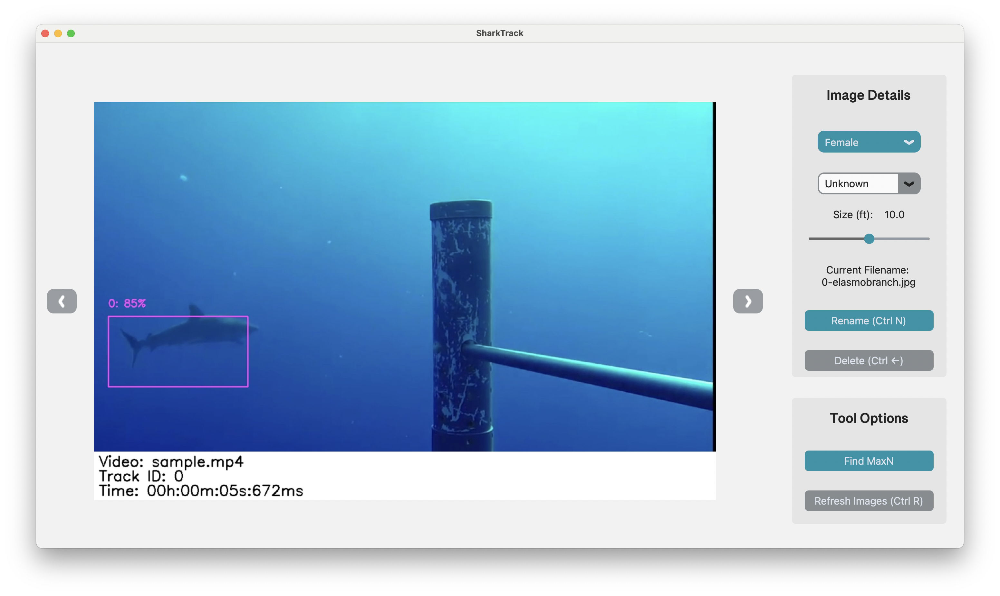

# Desktop App for Data Processing

You can clean the data using your favourite file explorer or use our desktop app for the enhanced ability to classify/rename and delete detections.

<p>

## Contents

* <a href="#initial-setup">Initial Setup</a>
* <a href="#running-the-app">Running the app</a>
* <a href="#using-the-desktop-app">Using the Desktop App</a>

## Initial Setup

The app can be run from exactly the same terminal session as when you ran the model to generate your video output. 

If you have not run the model on your device and just want to use the app, follow the instructions in the *Installing SharkTrack* section of the [SharkTrack User Guide](./sharktrack-user-guide.md).

## Running the app

✏️ To specify the images to look through and configure your options, open the ```app_config.ini``` file in any text editor of your choice.

You will see two sections: 
 - **Paths** is where you specify the folder of your model output which by default is ```outputs/input_videos_processed/internal_results/sample```. Change this to whichever folder of images you wish to go through

 - **Preset Options** is where you can preset species that will be available to select when you load up the app. Simply add to the list with names seperated by a new line (feel free to delete the placeholder examples)


Then simply run the following command on Mac/Linux:

```bash
python venv/bin/activate
python3 sharktrack_ui.py
```

And your desktop app should appear 🎉

> The desktop app is currently only tested for Mac/Linux, but should still operate for Windows systems. If you have any issues with this please do email us!

> The terminal will tell you how many images were found in your provided directory and which species options it loaded in if specified in the ```app_config.ini``` file. 

## Using the Desktop App

The desktop app has 3 main sections:
 - The Image display
 - Image Details Panel
 - Options Panel

### Image Display

Here you can see and navigate through the model output folder, as you would with viewing it in a file browser.
You can navigate through the images using the ⬅️ left and ➡️ right buttons or arrow keys.


### Image Details Panel

🌟 Unlike a file explorer, this app gives you the unique ability to easily annotate/classify the detections. 🌟

This panel is where you can delete any detections that are not elasmobranchs, and then classify the files using drop down menus and selectors. We provide the options to classify:

- **Sex** - A dropdwon menu of Female, Male or Unknown
- **Species** - A dropdown menu, allowing for custom input (with default Unknown)
- **Size (ft)** - A slider to select the estimated size of the elasmobranch in feet (if Unknown select 0.0ft)

By selecting these options and renaming the file, we can then collate more detailed data.

Clean the data by deleting the images using the delete button or the keyboard shortcut *Ctrl + Backspace*

Then classify the detections by selecting the correct informationa and renaming the file using the rename button or the keyboard shortcut *Ctrl + N*

See more details about classifying in the [Annotation Pipeline Guide](./annotation-pipelines.md).

### Options Panel

- Refresh Images : If you re-run the model or change the images in the folder currently open in the app, this will refresh the images displayed in the app

- Find MaxN : Ability to run the MaxN script via the tool - in development 🚧 

> On some devices the buttons can be occasionally unresponsive so we recomend navigating using the arrow keys and keyboard commands