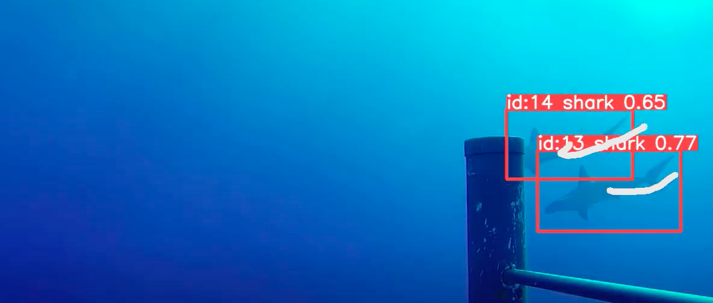
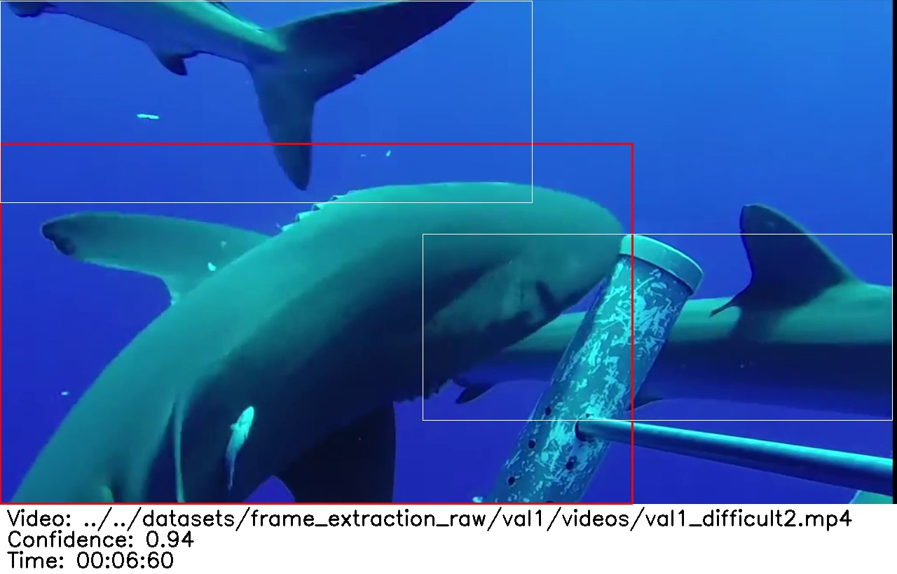

# SharkTrack
*Speeding up Elasmobranch BRUVS processing by 20x...*

## Before we start...

Here we provide a guide to learn about SharkTrack. The guide is divided in the following 3 chapters. We suggest you to spend ~15m to read them and understand the model, but feel free to jump to the sections as you like.

| Chapter | Reading Time | Description
|--|--|--|
| [Introduction to SharkTrack](./readme.md#introduction-to-sharktrack) | 7m | This page is for users who are just considering the use of AI in their workflow, and aren't even sure yet whether SharkTrack would be useful. It summarizes what we do with the model, how it can help you and how other people use it | 
| [SharkTrack User Guide](./sharktrack-user-guide.md) | 5m | This is a guide to run SharkTrack on your data. Jump to it if you're already familiar with SharkTrack and you're ready to run it on your data (and you have some familiarity with running Python code).
| [Annotation Pipeline](./annotation-pipelines.md) | 6m | This page illustrates the AI-enhanced BRUVS annotation workflow. Jump to it to convert the model's output into MaxN metrics 

[](https://drive.google.com/file/d/1b_74wdPXyJPe2P-m1c45jjsV2C5Itr-R/view?usp=sharing)
*Click on the image above to watch a demo*


# Introduction to SharkTrack

## Contents

* <a href="#overview">Overview</a>
* <a href="#what-does-sharktrack-do">What does SharkTrack do?</a>
* <a href="#how-is-it-useful">How is it useful?</a>
* <a href="#how-people-run-sharktrack">How do people run SharkTrack?</a>
* <a href="#list-of-people-using-it">List of people using it</a>
* <a href="#contributors">Contributors</a>
* <a href="#collaborations">Collaborations</a>
* <a href="#next-stpes">Next Steps</a>

## Overview
Elasmobranch researchers monitor their populations using Baited Remote Underwater Video Systems (BRUVS). This is a time-consuming process, as each video needs to be manually annotated. 

SharkTrack is a Machine Learning model that uses computer vision to detect and track Elasmobranchii in BRUVS videos. It does not classify the species. However, by simply detecting video snippets with sharks, the model drastically speeds up BRUVS annotation. Additionally, this package provides users a workflow to annotate species ID from model detectios.

> Therefore SharkTrack is an AI-enhanced workflow to convert raw BRUVS videos to MaxN, which has been tested 20x faster than traditional methods.

## What does SharkTrack do?
SharkTrack is a AI-enhanced BRUVS annotation pipeline.

What this jargon means is that it does the following steps:
1. Takes a folder with BRUVS videos, detects where sharks are in the videos.
2. Communicates this with an output [like this](./static/test-output/). Read [this](./annotation-pipelines.md#understand-the-output) to learn about our output format and its motivations. 
3. Provides a workflow for users to quickly clean detections and assign species ID.

Basically, its goal is to allow researchers to spend time *only* classifying shark species, saving the majority of time spent looking at empty frames.

<p>

*Example image showing the video and time of the red detection*

## How is it useful?
The main use of SharkTrack is to compute BRUVS MaxN in hours instead of months (or years!). It can do this on a modern but simple laptop, without access to WIFI or GPU.

If not [fine tuned](#bespoke-deployment), it achieves ~90% MaxN accuracy. We understand that some researchers might require higher accuracy metrics, or might want to double check them. In this case, SharkTrack is very useful in providing a general overview of where sharks are in the BRUVS videos.

Researchers also use SharkTrack during sampling, to process BRUVS overnight and share findings the next day.


We have two main types of users:
### BRUVS Analyst
They analyse the BRUVS to compute accurate MaxN metrics. High accuracy is crucial to them, and they have less strict time constraints.

They use the default SharkTrack mode, called `analyst`, to detect Elasmobranch and easily annotate the species and compute MaxN.

### Field Researcher
They are currently doing BRUVS deployment. They want their daily videos to be processed overnight to share detections with the team and externally and have a precise idea of which sampling site records more sharks.

They can use the `peek` mode of SharkTrack. This mode extracts interesting frames from the video, without providing annotation or MaxN support, but it is helpful to have a quick overview of their daily videos. 

You can check more about the two versions of SharkTrack ][here](./sharktrack-user-guide.md#how-fastaccurate-is-sharktrack)


## How people run SharkTrack?
SharkTrack is a publicly-available model, and the [SharkTrack User Guide](./sharktrack-user-guide.md) provides instructions for running it using our Python scripts. Many of our users run SharkTrack on their own, either on the cloud or on their local computers.

That said, we know that Python can be a bit daunting to setup. Additionally, SharkTrack requires significant processing power which, despite we have designed it for mobile usage, might still be a challenge. Therefore, some users - particularly high-volume users - send us BRUVS videos (online or physical hard drives), which we run through SharkTrack, then we send back a results file. 

If that is of interest for you, please read the [Bespoke Deployment](###bespoke-deployment) section.

Whether you're going to run SharkTrack on your own or work with us, usually the first step with a new user is just running our model on a short BRUVS video and seeing what happens, so if you're interested in trying this on your BRUVS, we can work out a way to transfer a set of example images, just [email us](mailto:fppvrn@gmail.com?subject=SharkTrack-Pilot).

## List of people using it
- [University of Exeter](https://www.linkedin.com/posts/filippo-varini_we-are-back-from-university-of-exeter-activity-7167899292593065985-dZLo?utm_source=share&utm_medium=member_desktop)
- [Shark Research Institute Mexico](https://www.sharkresearchmexico.com/) 


## Contributors
This software was written and supported by the efforts of
- [Filippo Varini](https://www.linkedin.com/in/filippo-varini/)
- [Sophie Wilday](https://www.linkedin.com/in/sophie-wilday-889663b9/)
- [Jeremy Jenrette](https://jeremyjenrette.weebly.com/)
- [Dr Joel Gayford](https://www.sharkmeasurements.com/)
- [Prof Ben Glocker](https://www.imperial.ac.uk/people/b.glocker)
- [Prof Francesco Ferretti](https://ferrettigs.github.io/)

## Collaborations
### License & Citation
This repository is licensed with the [MIT license](https://opensource.org/license/mit). If you use MegaDetector in a publication, please cite:

Varini, F. et al (2024). SharkTrack. Github. Available at
https://github.com/filippovarini/sharktrack


The same citation, in BibTex format:

```BibTex
@article{varini2024sharktrack,
  title={SharkTrack},
  author={Filippo Varini et al},
  year={2024}
}
```
### Issues
Please submit any issue on [GitHub](https://github.com/filippovarini/sharktrack/issues). We aim to respond to it within a week.
### Contribution
This project welcomes contributions, as pull requests, issues, or suggestions by [email](mailto:fppvrn@gmail.com?subject=SharkTrackContribution).

This is the first step of a broader effort to develop generalisable marine species classifiers. We are looking for contributors for this project. If you want to get involved in AI-driven Ocean Conservation please email us.

### Contacts
- [Email](mailto:fppvrn@gmail.com?subject=SharkTrackGeneral)
- Website
- [Linkedin](https://www.linkedin.com/in/filippo-varini/)
- [X](https://twitter.com/filippo_varini)

### Bespoke Deployment
Sometimes our users have high volume of BRUVS videos they want to be processed or specific requirements for SharkTrack, such for it to classify certain species or work in particularly challenging environments. 

In this case, we offer a bespoke deployment service. We understand their requirements, collect their data and train a tailored model ourselves that satisfies their needs. Currently, we require funding for this service.

If this is of interest for your organisation, please reach out via email by answering the following questions:

1. Can you provide a short overview of your project? What ecosystem and locations are you working in? What is the water quality? What are the key species found (besides Elasmobranchii)?

2. About how many hours of BRUVS do you have waiting for processing right now? Are these stereo systems?

3. About how many hours do you expect to collect in the next, e.g., 1 year?

4. What tools do you use to process and annotate images? For example, do you:

    - Move images to folders named by species
    - Keep an Excel spreadsheet open and fill it with filenames and species IDs
    - Use a tool like Eventmeasure

5. About what percentage of your videos is empty?

6. If you are also interested in Species ID, what are the key speceis you would like to classify? 

7. Do you have an NVIDIA GPU available (or access to cloud-based NVIDIA GPUs)? "I don't know what a GPU is" is a perfectly good answer.

8. At the place where you plan to do most of your work, how is your bandwidth? If you're able to visit speedtest.net to measure your upload and download speeds, that's helpful.

9. How did you hear about SharkTrack?

10. Do you have any legal or policy constraints that prevent you from using cloud-based tools to manage or review your images?

11. What is your level of fluency in Python?

12. About how many images do you have that you've already annotated, from roughly the same environments? What annotations?

## Next Stpes
Run the model on your BRUVS by following [this guide](./sharktrack-user-guide.md)
