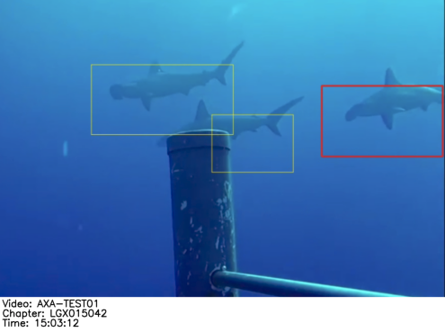
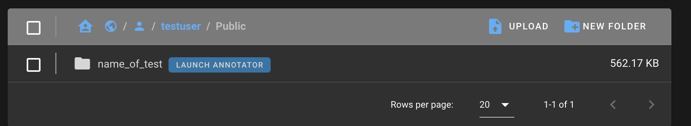
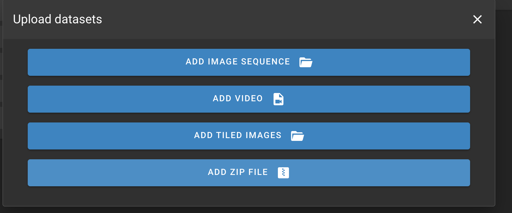
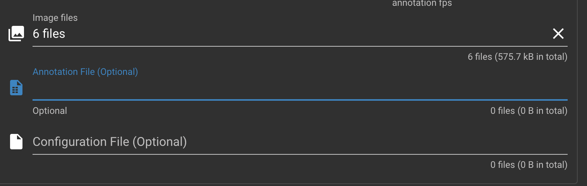
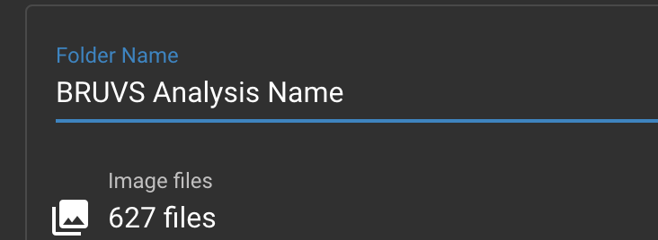
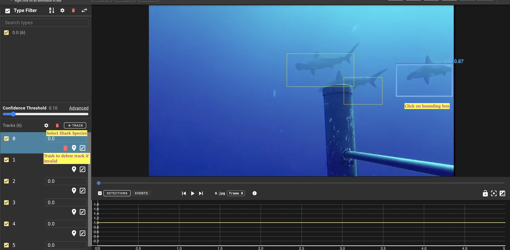
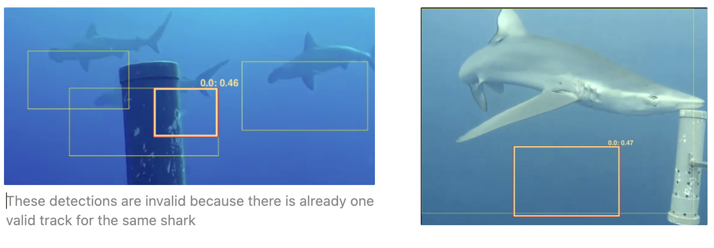
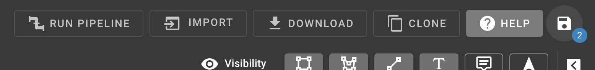

# SharkTrack
This is a package to run a shark detector and tracker model and compute MaxN annotations from it.


[](https://drive.google.com/file/d/1b_74wdPXyJPe2P-m1c45jjsV2C5Itr-R/view?usp=sharing)
Click on the image above to watch a demo

## Installation
1. ` git clone https://github.com/filippovarini/sharktrack.git`
2. `python -m venv venv` can also use python3
3. `source venv/bin/activate`
4. `pip install -r requirements.txt`
5. Download the models from [here](https://drive.google.com/drive/folders/1KE5ko9XaSc6q1dDtWrB1gB8RKWjJKkcx?usp=sharing) and place them in the `models` folder
5. `python app.py --video_path <path_to_video>`

## Running the SharkTrack Model

### 1. Running the model on a single video

### 2. Running the model on multiple videos
To run the model on multiple videos, you just need to point the script to the root folder containing the videos in the following structure:
```
videos_root
      ├── video1
      │   ├── chapter1.mp4
      │   ├── chapter2.mp4
      └── video2
          ├── chapter1.mp4
          ├── chapter2.mp4

```

### 📹 GoPro Compatibility ⛔️
GoPro videos are not compatible with the model. To make them compatible, you need to convert them to a format that the model can read. You can use the [script here](./scripts/process_gopro.py) to convert the videos, by running the following command:
```bash
python scripts/process_gopro.py --input_path path_to_gopro_videos --output_path path_to_output_folder
```
This script copies the videos to the output folder, with the cleaned format. You should use this script to copy the videos from an external drive to your local machine, before running the model. 

## Processing SharkTrack Annotations


📺 **Tutorials**:
You can also follow this documentation using the following video tutorials:

- [Uploading and cleaning detections in VIAME](https://drive.google.com/file/d/16Zw69ELvA1_pBhfcbQsjo1nc_7EBYZl2/view?usp=sharing)
- [Computing MaxN after downloading VIAME-cleaned detections](https://drive.google.com/file/d/1DCT3vCAbAH4T8wTiMjgWUc7-lZEpgz9U/view?usp=drive_link)

This document outlines a simple process to clean the predictions generated by the SharkTrack model and generate a MaxN file.

1. **Familiarise with the Output:** locate the `./output` file, containing the model output. This file contains the following subitems:
    1. `./output.csv` a csv file listing every detection in every frame of every video
    2. `./viame.csv` a csv file listing one detection per tracked shark, for the frame in which it was detected with highest confidence
    3. `./detections` for each tracked shark, this folder shows the frame in which it achieved maximum confidence. As you can see from the image below, the image also shows the other detections, although we are interested only in the highlighted one.
        
        
        
2. **Setup Annotations Platform**
    1. Open [VIAME](https://viame.kitware.com/)
    2. Create an account
    3. Click “Upload“ > Add Image Sequence
        
        
        
        
        
    4. Upload all the images in `./detections`
    5. Click on “annotation file” and upload `viame.csv`
        
        
        
    6. Pick a name for the BRUVS analysis

        
    7. Confirm upload
3. **Clean Annotations**
    1. Click Launch Annotator
    2. For each frame
        
        
        
        1. Identify the track by clicking on the highlighted bounding box
        2. If the detection is valid, insert the shark species
            
            
            
        3. If the detection is invalid, delete the track by clicking on the trash
            
            
            
4. **Download Cleaned Annotations**
    
    
    
    1. Click on the 💾 Icon
    2. Then click Download > Viame CSV and download the file
5. **Extract MaxN from Cleaned Annotations**
    
    
    
    1. Open this [Collab Notebook](https://colab.research.google.com/drive/1oiJgt1TZnBoKLi3PCZBKtiH0NnRsb-0Z?authuser=0#scrollTo=qfJdcsy_D5i1)
    2. Upload the original `output.csv` file and the cleaned viame file you downloaded in step 4
    3. Edit cell two and insert the names of the files
    4. Run both cells
    5. Close and reopen the 📁 icon (left side)
    6. You will see a `max_n.csv` file, which is your final CSV