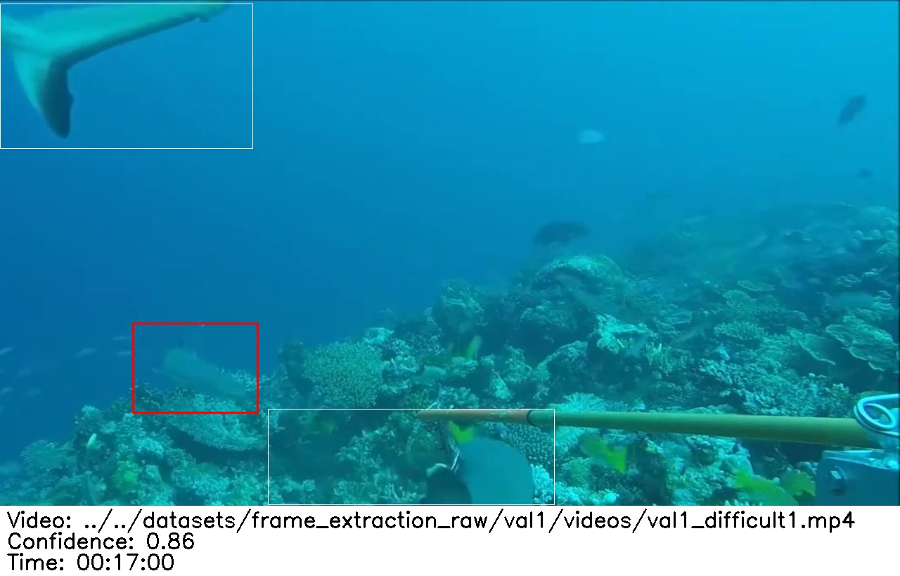

# SharkTrack User Guide
*How to run SharkTrack on your BRUVS...*

## Contents

* <a href="#overview">Overview</a>
* <a href="#our-ask-to-sharktrack-user">Our Ask to SharkTrack user</a>
* <a href="#quick-tutorial">Quick Tutorial</a>
* <a href="#how-fast-is-sharktrack-can-i-use-it-on-my-laptop">How fast is SharkTrack Can I use it on my laptop?</a>
* <a href="#how-to-run-sharktrack">How to run SharkTrack</a>
* <a href="#model-types-mobile-vs-analyst">Model Types: Mobile vs Analyst</a>
* <a href="#can-i-trust-its-accuracy">Can I trust it's accuracy?</a>
* <a href="#next-steps">Next steps</a>

## Overview
The first step to process your BRUVS videos is running the model on them. This page explains how to go from raw videos to a detection output [like this](./static/test-output/). You can learn the output structure [here](./readme.md#what-does-sharktrack-do).


*An example of SharkTrack output detection*

## Our Ask to SharkTrack user
SharkTrack is free, and it makes us super-happy when people use it, so we put it out there as a downloadable model that is easy to use. That means we don't know who's using it unless you contact us, so please please [email us](mailto:fppvrn@gmail.com?subject=SharkTrackUser) and star this repo if you find it useful!

## Quick Tutorial
1. Clone SharkTrack
    ```bash
    git clone https://github.com/filippovarini/sharktrack.git
    cd sharktrack
    ```
2. Setup Virtual Environment
    ```bash
    python -m venv venv # use python3 on mac
    source venv/bin/activate
    pip install -r requirements.txt
    ```
3. Download the models from [here](https://drive.google.com/drive/folders/1KE5ko9XaSc6q1dDtWrB1gB8RKWjJKkcx?usp=sharing) and place them in the `./models`

4. Run the model
    ```bash
    python app.py --input_root <path_to_video_folder> --mobile
    ```

## How fast is SharkTrack? Can I use it on my laptop?
We have provided 2 SharkTrack models, the mobile and analyst models. Both models are able to run on the CPU. The analyst model is more accurate, but takes more. 
You can find a more thorough comparison [here](#model-types-mobile-vs-analyst).

As a rule of thumb, we suggest running the more accurate model first. If that is too slow, you can switch to the mobile model by simply passing the `--mobile` in the [run script](#2-running-the-model).

## How to run SharkTrack

### 1. Environment Setup
We recommend setting up the model in the suggested directory, to re-use the virtual environment. That said, feel free to change the download location if you have a reason to
#### Windows
```bash
mkdir c:\git
cd c:\git
git clone https://github.com/filippovarini/sharktrack.git
cd c:\git\sharktrack
python -m venv venv
source venv/bin/activate
pip install -r requirements.txt
set PYTHONPATH=c:\git\sharktrack
```

#### Mac/Linux
```bash
mkdir ~/git
cd ~/git
git clone https://github.com/filippovarini/sharktrack.git
cd ~/git/sharktrack
python -m venv venv
source venv/bin/activate
pip install -r requirements.txt
export PYTHONPATH="$HOME/git/sharktrack"
```

### 2. Running the model
You now are ready to run SharkTrack! You can do so using the following command

```bash
python app.py --input_root <path_to_video_folder> --mobile
```

#### Arguments
- `--input_root` Path to the video folder. SharkTrack takes a folder of arbitrary depth as input and processes all .mp4 videos in it.
- `--stereo_prefix` If your folder contains Stereo-BRUVS, you can tell SharkTrack to only process the left or right video by passing the prefix of the videos you want to process (i.e. `LGX`)
- `--max_videos` Limit of videos to process (default=1000)
- `--output_dir` Path to output folder (default=`./output`)
- `--mobile` Whether to run the mobile version of the model. More info [here](#mobile-vs-analyst).

## Model Types: Mobile vs Analyst
|Model|Accuracy (F1)| CPU Inference Time | Limitations | Good for
|--|--|--| --| --|
|`analyst`| 0.85 | 1.5x video speed | Can't process GoPro | Above-human-level detection accuracy
|`mobile`|0.83 | 3.5x video speed | Unstable tracking | Quick overview of daily BRUVS deployment

### GoPro Limitation 📹⛔️
The `analyst` model uses `OpenCV` speed-up the video read and achieve creditable speed for its size. Unfortunately, OpenCV fails with the GoPro audio encoding (GoPro AAC), as documented [here](https://stackoverflow.com/questions/78039408/cv2-ffmpeg-grabframe-packet-read-max-attempts-exceeded-error-after-exactly-rea).

> Therefore, the `analyst` model can't process GoPro videos

To solve this issue, we have provided a [script](./scripts/reformat_gopro.py) to reformat the videos by removing the audio stream. 

You can run it with the following command:
```bash
python scripts/reformat_gopro.py --input_root <Original video folder path> --output_root <New video folder path>
```
If the videos are Stereo-BRUVS, you can use the `--stereo_prefix` to only reformat left/right videos, as described [here](#arguments).

This script takes approximately 6x the video speed. This is a time delay that we aim to remove in the future. 

The good news is that this script is an alternative command to copy data. Therefore, researchers can use it to transfer data from GoPro SD cards to the laptop/drive. In this case, the time delay will be the same as currently experienced doing data transfer.

#### So what should I do if I am doing GoPro BRUVS survey?
1. Collect BRUVS videos
2. When you get home, for each GoPro, connect the SD and run 
    ```bash
    python scripts/reformat_gopro.py --input_root PATH_TO_SD --output_root COPY_DESTINATION
    ```
    Ideally, use the same destination
3. Overnight run the model on the copied data 
    ```bash
    python app.py --input_root COPY_DESTINATION
    ```

If you know of a better solution, please [email us](mailto:fppvrn@gmail.com?subject=SharkTrackSuggestion)!

## Can I trust it's accuracy?


## Next steps
After following the steps you will have an output folder with detections. It is now time to remove the incorrect annotations and assign Species ID.

Please follow the documentations on [the next step](./annotation-pipelines.md).
