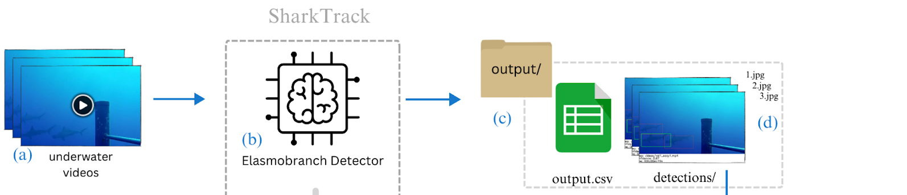

# SharkTrack User Guide
*How to run SharkTrack on your BRUVS...*

## Before Starting
SharkTrack is free, and it makes us super-happy when people use it. But we don't who is using it unless you tell us!

> PLEASE PLEASE FILL IN THIS [**30 SECONDS FORM**](https://forms.gle/sUeTarNqcTgxdyjU8) to tell us you are using SharkTrack.

It helps us support and spotlight you on our website! 


## Overview
This page guides you to download SharkTrack and run it on your videos. 

> If you already have an output and want to comput MaxN, jump to [this guide](./annotation-pipelines.md)

This would complete the Step 1 of the BRUVS analysis process, as showed in the image below.

*Step 1: Given a folder or hard drive with BRUVSs (a), SharkTRack automatically process the videos and detects elasmobranchs (b). It then saves all detection information in a CSV file (c) and stores a detection image for each individual elasmobranch found (d).*


## Installing SharkTrack
If you don't have experience with Python, don't fear! Follow this guide step by step and you will have it running shortly. Don't hesitate to ask [here]([GitHub](https://github.com/filippovarini/sharktrack/issues)).


### Pre-Requirements
You must have Python 3.9 and above. To check the version:
- On **Windows**:
    - Open the Command Prompt by typing cmd in the search bar and hitting Enter.
    - Type the following command and press Enter: `python --version`
    - This will display the installed Python version.
- On **macOS**:
    - Open the Terminal (you can find it using Spotlight or under Applications > Utilities).
    - Type the following command and press Enter: `python3 --version`
    - This will display the installed Python 3 version.
    - If no version is found, you have an older version than 3. To check it, type `python --version` and hit enter.

> If you don't have Python 3.9 or above, install it [here](https://www.python.org/downloads/)


### Downloading the model
1. Download the model from [here](https://github.com/filippovarini/sharktrack/releases) by double-clicking on the latest "source code". Dowload the zipfile only!
2. Unzip the folder to extract `sharktrack`
3. Move `sharktrack` to the Desktop and:
    - If on **Windows**:
        - Open the extracted `sharktrack` folder
        - If you use Python from the Command Prompt
            - Replace the text in the [address bar](https://uis.georgetown.edu/wp-content/uploads/2019/05/win10-fileexplorer-addrbar.png) with `cmd` and hit Enter
        - Alternatively, if you use `anaconda`:
            - Click on the [address bar](https://uis.georgetown.edu/wp-content/uploads/2019/05/win10-fileexplorer-addrbar.png)
            - Click "Copy address" in the address bar
            - Open the Anaconda Prompt
            - Run `cd {the address you just copied}`
        - This sholuld show you the Command/Anaconda Prompt application
    - If on **Mac/Linux**:
        - Right-click on the `sharktrack` folder
        - Click "New Terminal at Folder" (sometimes this is under Services)
        - This should show you the Terminal application
    

### Setup Environment
Now you have the downloaded the model and you have the Terminal application open. It is time to setup the software environment.
- **If you use Anaconda**
    ```
    conda create -n sharktrack anaconda
    conda activate sharktrack
    pip install -r requirements.txt
    ```

- **Otherwise, on Windows**
    ```
    python -m venv venv
    venv\Scripts\activate.bat
    pip install -r requirements.txt
    ```
- **Or Mac/Linux**
    
    1. Firstly, copy-paste in Terminal the following command and hit enter:
        ```
        python -m venv venv
        ```
        If it fails, try copy-pasting this command instead `python3 -m venv venv`.
    2. Secondly, copy-paste in Terminal the following command and hit enter:
        ```
        source venv/bin/activate
        pip install -r requirements.txt
        ```
    
*If you encounter any problem, check out the [troubleshooting](#troubleshooting) section.*

## Running SharkTrack
Congratulations on setting up SharkTrack, you are ready to run it!

From now on, whenever you want to run SharkTrack, jump to this section.

You can move your videos in the `./input_videos` folder which is inside sharktrack to process them automatically. Otherwise, you can specif the path of the folder where they are stored.

Then, running the following commands
- **If you use Anaconda**
    ```
    conda activate sharktrack
    python app.py
    ```

- **Otherwise, on Windows**
    ```
    venv\Scripts\activate.bat
    python app.py
    ```
- **Or Mac/Linux**
    ```
    source venv/bin/activate
    python app.py
    ```

> After the model finishes running, it will show how many tracks it found! You can now check the results in the output folder. Now it is time to **Generate MaxN**. Move to the [next page for instructions](./annotation-pipelines.md).

> ⏰ The model takes 0.75% video time to run on CPU. If you need a faster model, check the [SharkTrack Peek Mode](#sharktrackpeek-mode)

### Configuration
In python, you can configure by adding arguments to the "command":
```bash
python app.py --arg1 {val1} --arg2 {val2} --arg3
```
Here, `arg1`, `arg2` is the name of the argument and `val1` and `val2` their respective value. 
`arg3` doesn't require a value, it's just a configuration (like `--peek` below).

Below is a list of arguments you can use:

- `--input {vale}` Path to the video folder. SharkTrack takes a folder of arbitrary depth as input and processes all .mp4 videos in it.
- `--stereo_prefix {value}` Run the model only on video whose filename starts with a specific prefix (useful for Stereo-BRUVS).
- `--limit {value}` Limit of videos to process (default=1000)
- `--conf {value}` Set custom confidence threshold, default=0.25.
- `--output {value}` Path to output folder (default=`./outputs`)
- `--peek` Run the model in [peek mode](#sharktrackpeek-mode)
- `--chapters` Use if your videos are broken into chapters. The model aggregates the chapter information into one single video
- `--resume` Skip videos already analysed in the provided `--output` path. Use it when resuming a SharkTrack ran which stopped early or when analysing multi-day studies in the same folder. 

Example:
```bash
python app.py --input G:\BRUVS_2023 --peek  --stereo_prefix L
```
*This runs SharkTrack peek mode on all videos from G:\BRUVS_2023 starting with "L"*

## SharkTrackPeek Mode
You can use SharkTrack to extract interesting frames in the video, without tracking Elasmobranchs. 

This "peek" version runs 5x faster, taking 15% of real video time. However, peek mode will only output interesting frames, without the possibility of computing MaxN. 

You can activate it by adding the `--peek` argument (i.e.`python app.py --peek` )

The output will contain a folder names `peek_frames`, listing all the detections found by the model.

This mode is particularly useful if you are doing field deployment and want to compute a quick overview of your daily videos, but you can't leave your machine running for hours.

> **Note** We recommend trying the default mode first, as it provides finer grained and more accurate information.

## Troubleshooting
Below you can find solutions to common problems encountered.

### Installation and Setup
- *The terminal/prompt is showing an error saying I need `git`* Go ahead and [install it](https://git-scm.com/book/en/v2/Getting-Started-Installing-Git). Alternatively, download the latest "source code"  [from here](https://github.com/filippovarini/sharktrack/releases).
- *`python -m venv venv` says `python` not found* Try running `python3 -m venv venv` or `py -m venv venv` 
- *`python -m venv venv` says `venv` module not found* Check the python version by running `python --version` and make sure it's older than 3.8.If not download it [here](https://www.python.org/downloads/). Once it's downloaded, try running the same command. If it still fails, run `python3 -m venv venv`

### GoPro Limitation 📹⛔️
If the Command Prompt/Terminal shows you the following message
```bash
[ WARN:0@379.898] global cap_ffmpeg_impl.hpp:1541 grabFrame packet read max attempts exceeded, if your video have multiple streams (video, audio) try to increase attempt limit by setting environment variable OPENCV_FFMPEG_READ_ATTEMPTS (current value is 10000)
```
it means that your GoPro version is incompatible with the software (if interested, learn more [here](https://stackoverflow.com/questions/78039408/cv2-ffmpeg-grabframe-packet-read-max-attempts-exceeded-error-after-exactly-rea)).

Therefore, the model can't process your videos. To solve this issue, we have provided a [script](./utils/reformat_gopro.py) to reformat the videos by removing the audio stream. 

> **NOTE** You need to have `ffmpeg` installed. Check this by running `ffmpeg -version`. If you don't have it, download it [here](https://ffmpeg.org/download.html) by following [this](https://www.youtube.com/watch?v=22vmzTs5BoE) tutorial. Close and re-open the Prompt/Terminal once you download it.

You can run it with the following command:
```bash
python utils/reformat_gopro.py --input {Original video folder path} --output {New video folder path}
```
If the videos are Stereo-BRUVS, you can use the `--stereo_prefix` to only reformat left/right videos, as described [here](#arguments).

This script takes at worst 1/6x  the video speed. This is a time delay that we aim to remove in the future. 

The good news is that this script is an alternative command to copy data. Therefore, researchers can use it to transfer data from GoPro SD cards to the laptop/drive. In this case, the time delay will be the same as currently experienced doing data transfer.

#### So what should I do if I am doing GoPro BRUVS survey?
1. Collect BRUVS videos
2. When you get home, for each GoPro, connect the SD and run 
    ```bash
    python utils/reformat_gopro.py --input PATH_TO_SD --output COPY_DESTINATION
    ```
    Ideally, use the same destination
3. Overnight run the model on the copied data 
    ```bash
    python app.py --input COPY_DESTINATION
    ```

If you know of a better solution, please [email us](mailto:fppvrn@gmail.com?subject=SharkTrackSuggestion)!

## How fast/accurate is SharkTrack?
|Mode|Feature| Inference Time | Limitations | Good for
|--|--|--| --| --|
|`analyst` (default)| Compute MaxN | 27m per video-hour | Slower and can't process videos of some GoPro versions | Species-ID and MaxN
|`peek`| Extract interesting frames | 9m per video-hour | Doesn't support annotation and outputs many more frames to review | Extract all frames with Elasmobranch

Additionally, the pipeline is designed to minimise False Positives and leverage human knowledge. That is, it has a very low confidence threshold. This ensures close to all sharks are detected, but causes 5x "garbage detections", which the user manually rejects. We found that researchers are happier to have control over the rejection of the detections, knowing that everything was captured.

That being said, sometimes SharkTrack doesn't detect an elasmobranch. In this case, the shark will be lost by the pipeline, causing unaccurate MaxN. However, our validation tests prove that the frequency is smaller than human error.

## Next steps
After following the steps you will have an output folder with detections. It is now time to remove the incorrect annotations and assign Species ID.

Please follow the documentations on [the next step](./annotation-pipelines.md).
